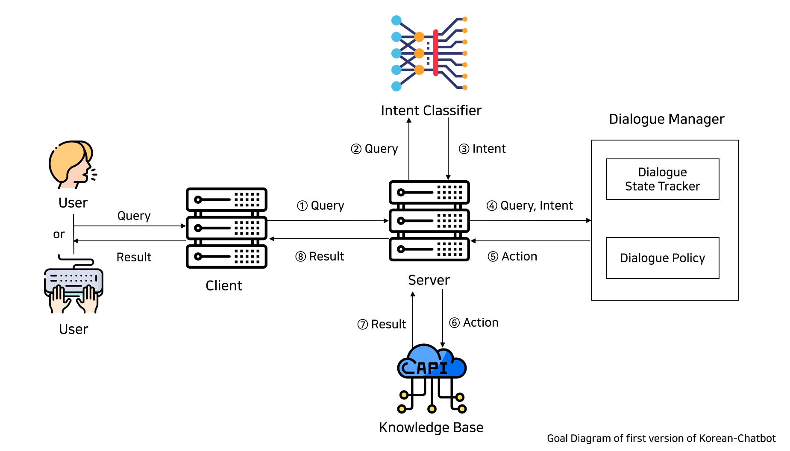

# Korean Chatbot
Korean chatbot is a task-oriented dialogue system. it orients a multi-domain, multi-turn and a hybrid(ontology-free and pre-defined ontology) dialogue system.


## Environment and Installation
- Windows 10
- CUDA 11.2
- python 3.6
- pip install -r requirements.txt

## Model Training
Run following three scripts to fine-tune the model.
``` python
>>> python train_intent.py
>>> python train_entity.py
>>> python train_question.py
```
if you run a script, then it makes fine-tuned model. BERT model is used to train an intent classification, entity recognition model and question answering model for now. other model will be updated.

## Model Inference
if you want to do inference, then you can run the following script. import Predict class from `predict.py` then create an instance method with a sentence that you want to query.
``` python
>>> from predict import Predict
    
>>> P = Predict()
    
>>> intent = P.predict_intent(sentence)
>>> entity = P.predict_entity(sentence)
>>> answer = P.predict_question(context, query)
```

## Server and Client
Run following script to run both server and client. 
``` python
>>> python server.py
>>> python client.py
```
if you want to do a test, then you can type `http://127.0.0.1:4999/?query=오늘 날씨 알려줘`. after typing this, you can hear a voice and get information that is made by a bot. so far only the weather function is working.